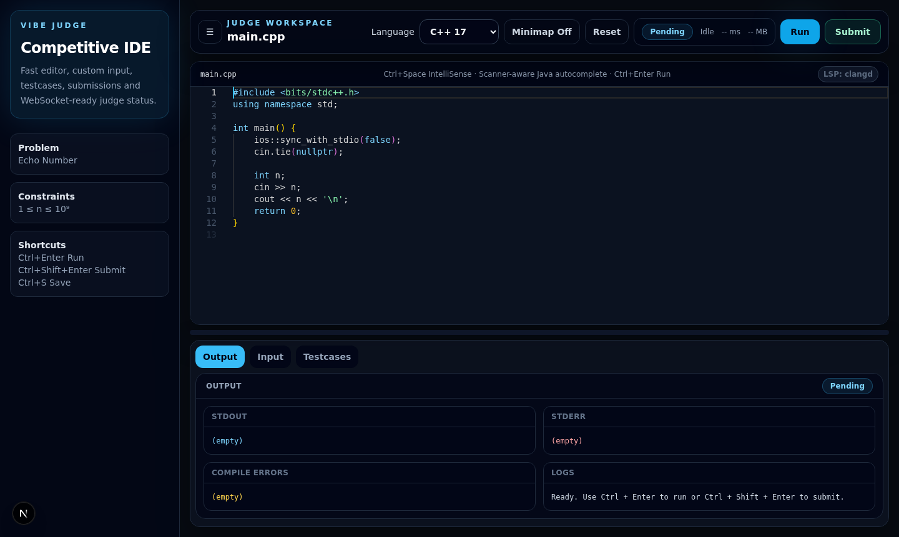
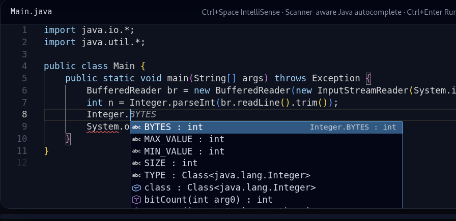
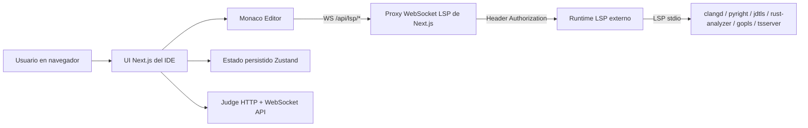
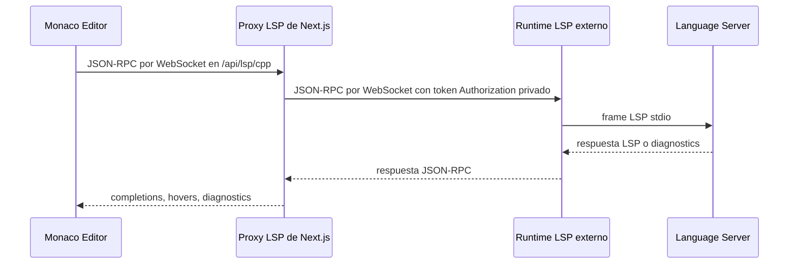
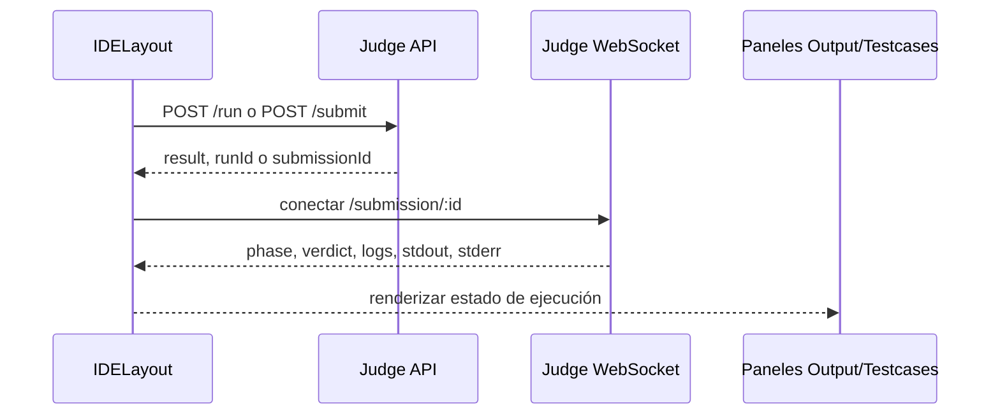

# Vibe Judge IDE

[English](README.md) · Español

Vibe Judge IDE es un entorno de programación competitiva en navegador construido con **Next.js**, **React**, **TypeScript**, **Tailwind CSS**, **Monaco Editor**, **Zustand** e integraciones por WebSocket para juez y LSP.

Está pensado para plataformas de juez en línea que necesitan una interfaz de código enfocada: el competidor puede leer el enunciado, escribir una solución de un solo archivo, ejecutarla con entrada personalizada o casos de prueba, enviarla al backend del juez y seguir el estado en tiempo real.

## Qué contiene este repositorio

Este checkout contiene el **IDE web**:

- Aplicación Next.js y servidor WebSocket custom (`server.mjs`).
- Editor de código basado en Monaco.
- Estado de UI/código persistido con Zustand.
- Integración con Judge API por HTTP y WebSocket opcional.
- Soporte de handoff Vibe: tokens del OJ, carga rápida con `/ide?id=<problemId>` y persistencia del token de sesión para recargar.
- Rutas proxy LSP del navegador al servidor bajo `/api/lsp/*`.

El runtime real de language servers se espera como servicio separado y debe ser alcanzable mediante `LSP_SERVER_WS_BASE` (por ejemplo `ws://127.0.0.1:3001`). Algunos scripts todavía apuntan a un directorio compañero `lsp/`; solo funcionan cuando ese directorio existe en tu checkout.

## Puntos fuertes

| Área | Capacidad |
| --- | --- |
| Editor | Monaco Editor con nombres de archivo por lenguaje y temas configurables |
| Lenguajes | C++17, Python 3, Java 17, JavaScript, Rust y Go |
| Enunciado | Panel de problema en español con vista dividida redimensionable y MathJax para LaTeX |
| Ejecución | Paneles separados para salida, stdin, testcases, logs, runtime y memoria |
| Persistencia | Código, lenguaje, testcases, layout, minimapa, tema se guardan localmente; el último token de lanzamiento se guarda en sessionStorage |
| Juez | Contexto Vibe, llamadas HTTP `run`/`submit`, polling y estado por WebSocket opcional |
| Proxy LSP | El navegador conecta a `/api/lsp/<language>` y el servidor reenvía el token privado al runtime LSP |
| Atajos | `Ctrl+Enter` para ejecutar, `Ctrl+Space` para sugerencias del editor |

## Capturas

### Workspace del IDE



### Autocompletado



### Estado LSP y paneles


## Arquitectura



### Flujo de mensajes LSP



### Flujo del juez



## Estructura de carpetas

| Ruta | Propósito |
| --- | --- |
| `app/` | Entradas de Next.js App Router y estilos globales |
| `components/` | Layout del IDE, editor, toolbar, badges de estado y paneles |
| `docs/assets/` | Capturas usadas por el README |
| `hooks/` | Atajos, resize de paneles, toast, conexión LSP del editor y acciones del juez |
| `lib/` | Metadata de lenguajes, config de UI, helpers de veredicto, temas y errores |
| `services/` | HTTP, Judge API, descarga de archivos y exports del cliente LSP |
| `store/` | Store Zustand y estado persistido por defecto |
| `types/` | Contratos TypeScript compartidos |
| `server.mjs` | Servidor Next.js custom y proxy WebSocket `/api/lsp/*` |

## Requisitos

- Node.js 20+ recomendado
- npm 10+
- Backend de juez si quieres ejecución/envío real
- Opcional: runtime LSP externo escuchando en `LSP_SERVER_WS_BASE`
- Opcional: Docker y Docker Compose si tu checkout incluye el directorio compañero `lsp/`

## Inicio rápido

```bash
git clone <repo-url>
cd vibe-ide
npm install
cp .env.example .env.local
npm run dev
```

Abre <http://localhost:3000>.

Si ejecutas el stack completo de Patito con compose, las URLs locales son solo HTTP:

```txt
http://patito.localhost/oj/
http://patito.localhost/ide/
http://patito.localhost/api/
```

El router Traefik del compose escucha en el puerto `80` y no redirige a HTTPS. Usa `ws://` para WebSockets en la configuración local.

## Cargar un problema de Patito

El flujo normal es:

1. El OJ abre `/oj/vibe-ide-launch.php?id=<problemId>` o su equivalente de contest.
2. Esa ruta crea un token temporal y redirige a `/ide?token=<token>`.
3. Vibe IDE guarda ese token en `sessionStorage`, lo quita de la barra de dirección y carga `/api/vibe/context`.

Para carga rápida local, Vibe IDE también acepta parámetros en la URL del IDE y redirige por el mismo flujo de launch:

```txt
http://patito.localhost/ide?id=1010
http://patito.localhost/ide?cid=3&pid=0
```

Después de un lanzamiento exitoso con token, recargar `http://patito.localhost/ide/` en la misma pestaña/sesión vuelve a cargar el último problema usando el token persistido.

## LaTeX y enunciados enriquecidos

Las secciones del problema pueden contener HTML y delimitadores LaTeX como `$N$`, `\(N\)`, `$$...$$` o `\[...\]`. El IDE sanitiza primero el HTML, lo escribe en el nodo del enunciado y recién después ejecuta MathJax sobre ese nodo. Ese orden evita que re-renders de React, como notificaciones toast, reemplacen la matemática renderizada por texto LaTeX crudo.

Si solo quieres revisar la UI, el backend del juez y el runtime LSP pueden estar apagados. Run/submit y LSP mostrarán errores de conexión hasta que sus servicios estén disponibles.

## Configurar el backend del juez

El frontend espera estos endpoints:

```txt
POST /vibe/runs
GET  /vibe/runs/{id}
POST /vibe/submissions
GET  /vibe/submissions/{id}
WS   /vibe/submissions/{id}/events (opcional)
```


El contrato genérico actualizado para integrar cualquier juez está documentado en [`docs/judge-api-contract.md`](docs/judge-api-contract.md).

Configura las URLs del juez en `.env.local` o `public/vibe-config.json`:

```env
NEXT_PUBLIC_JUDGE_API_URL="http://localhost:8080"
NEXT_PUBLIC_JUDGE_WS_URL="ws://localhost:8080"
NEXT_PUBLIC_VIBE_IDE_CONTEXT_URL="http://localhost:8080/api/vibe/context"
```

En el stack compose de Patito se usan valores runtime same-origin:

```json
{ "apiBaseUrl": "/api", "paths": { "context": "/vibe/context" } }
```

Si omites `NEXT_PUBLIC_JUDGE_WS_URL`, la app la deriva desde `NEXT_PUBLIC_JUDGE_API_URL`.

## Configurar LSP

El navegador no debe conocer el token privado del LSP. Monaco solo conecta a URLs proxy same-origin:

```env
NEXT_PUBLIC_LSP_CPP_WS="/api/lsp/cpp"
NEXT_PUBLIC_LSP_PYTHON_WS="/api/lsp/python"
NEXT_PUBLIC_LSP_JAVA_WS="/api/lsp/java"
NEXT_PUBLIC_LSP_JAVASCRIPT_WS="/api/lsp/js"
NEXT_PUBLIC_LSP_RUST_WS="/api/lsp/rust"
NEXT_PUBLIC_LSP_GO_WS="/api/lsp/go"
```

`server.mjs` recibe esos upgrades WebSocket y luego conecta al runtime LSP externo con un token privado del lado servidor:

```env
LSP_AUTH_TOKEN="dev-lsp-token"
LSP_SERVER_WS_BASE="ws://127.0.0.1:3001"
```

No cambies `LSP_AUTH_TOKEN` a `NEXT_PUBLIC_*`; todo lo que empieza con `NEXT_PUBLIC_` queda incluido en el código del navegador.

Rutas upstream esperadas del runtime LSP externo:

```txt
/lsp/java
/lsp/cpp
/lsp/python
/lsp/js
/lsp/rust
/lsp/go
```

## Ejemplo `.env.local`

```env
NEXT_PUBLIC_JUDGE_API_URL="http://localhost:8080"
NEXT_PUBLIC_JUDGE_WS_URL="ws://localhost:8080"
NEXT_PUBLIC_VIBE_IDE_CONTEXT_URL="http://localhost:8080/api/vibe/context"

NEXT_PUBLIC_LSP_CPP_WS="/api/lsp/cpp"
NEXT_PUBLIC_LSP_PYTHON_WS="/api/lsp/python"
NEXT_PUBLIC_LSP_JAVA_WS="/api/lsp/java"
NEXT_PUBLIC_LSP_JAVASCRIPT_WS="/api/lsp/js"
NEXT_PUBLIC_LSP_RUST_WS="/api/lsp/rust"
NEXT_PUBLIC_LSP_GO_WS="/api/lsp/go"

LSP_AUTH_TOKEN="dev-lsp-token"
LSP_SERVER_WS_BASE="ws://127.0.0.1:3001"
```

## Contrato Judge API

### `POST /run`

Request:

```json
{
  "sourceCode": "#include <bits/stdc++.h>...",
  "language": "cpp",
  "stdin": "5\n",
  "testcases": []
}
```

Response:

```json
{
  "runId": "run_123",
  "result": {
    "id": "run_123",
    "phase": "completed",
    "verdict": "Accepted",
    "stdout": "5\n",
    "stderr": "",
    "compileErrors": "",
    "logs": ["Finished."],
    "runtimeMs": 12,
    "memoryKb": 4096
  }
}
```

### `POST /submit`

```json
{ "submissionId": "sub_123" }
```

### Mensaje de estado por WebSocket

```json
{
  "submissionId": "sub_123",
  "phase": "running",
  "verdict": "Pending",
  "logs": ["Compiling..."]
}
```

## Scripts

| Script | Descripción |
| --- | --- |
| `npm run dev` | Inicia el servidor custom de Next.js (`server.mjs`) |
| `npm run build` | Construye la app de producción |
| `npm run start` | Inicia el servidor custom de producción después del build |
| `npm run typecheck` | Ejecuta TypeScript sin emitir archivos |
| `npm run lint` | Alias de `npm run typecheck` |
| `npm run check` | Ejecuta typecheck y build |
| `npm run lsp:up` | Helper legacy para checkouts donde el runtime LSP está copiado en `vibe-ide/lsp/` |
| `npm run lsp:up:detached` | Helper legacy detached para checkouts con `vibe-ide/lsp/` |
| `npm run lsp:logs` | Helper legacy de logs para checkouts con `vibe-ide/lsp/` |
| `npm run lsp:down` | Helper legacy para detener LSP en checkouts con `vibe-ide/lsp/` |
| `npm run lsp:cache` | Helper legacy de cache para `vibe-ide/lsp/`; en este layout usa `../vibe-lsp-server/storage/` |

## Agregar un lenguaje

1. Agrega el id del lenguaje y tipos compartidos en `types/ide.ts`.
2. Agrega metadata, id de Monaco, extensión de archivo y código inicial en `lib/language-options.ts`.
3. Agrega o actualiza la configuración frontend LSP para la nueva variable `NEXT_PUBLIC_LSP_*_WS`.
4. Agrega una ruta proxy `/api/lsp/<language>` en `server.mjs`.
5. Asegura que el runtime LSP externo exponga `/lsp/<language>`.
6. Documenta la nueva variable de entorno en ambos README y en `.env.example`.

## Troubleshooting

| Síntoma | Causa probable | Solución |
| --- | --- | --- |
| `LSP: <server>` aparece disabled | Falta la variable `NEXT_PUBLIC_LSP_*_WS` | Copia `.env.example` a `.env.local` y reinicia `npm run dev` |
| LSP se desconecta al instante | Falta `LSP_AUTH_TOKEN`, token incorrecto, upstream incorrecto o runtime LSP apagado | Revisa `.env.local`, `LSP_SERVER_WS_BASE` y logs del runtime externo |
| Hay preocupación porque el token aparece en el navegador | El token se expuso con una variable `NEXT_PUBLIC_*` | Mantén el secreto solo como `LSP_AUTH_TOKEN`; Monaco solo debe llamar a `/api/lsp/*` |
| Run/submit falla | Judge API no implementa el contrato esperado | Verifica `NEXT_PUBLIC_JUDGE_API_URL` y las rutas del backend |
| No llegan veredictos por WebSocket | URL WebSocket del juez incorrecta o bloqueada | Configura `NEXT_PUBLIC_JUDGE_WS_URL` explícitamente e inspecciona Network del navegador |
| Scripts LSP fallan porque falta `lsp/docker-compose.yml` | Este layout mantiene el runtime como hermano `../vibe-lsp-server` | Usa el servicio `vibe-lsp-server` del compose principal o ejecuta `docker compose up --build` dentro de `../vibe-lsp-server` |

## Licencia

Agrega una licencia antes de publicar este repositorio como open source.
